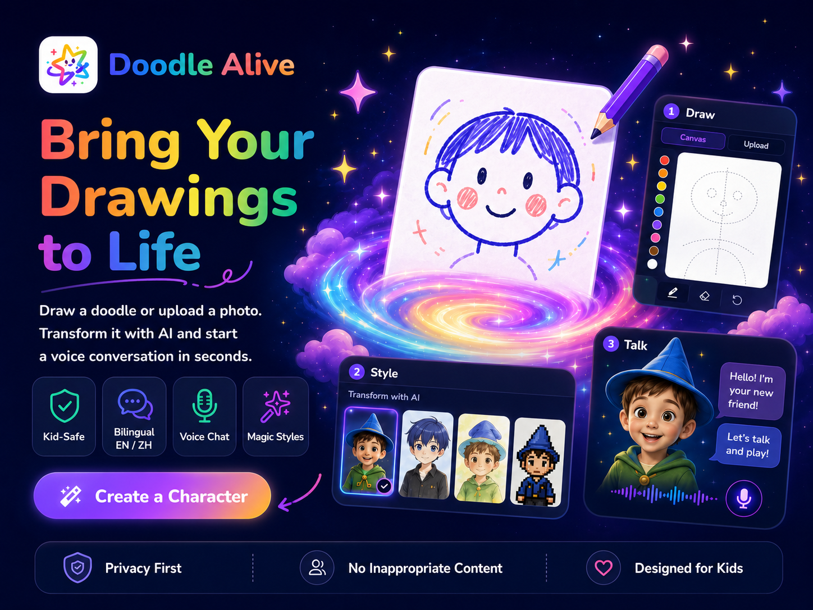

<div align="center">
  <h1>🎨 Doodle Alive</h1>
  <p>
    <strong>把孩子的涂鸦和照片，变成有风格、会说话的 AI 角色。</strong>
  </p>
  <p>
    <a href="README.md">English README</a>
  </p>
  
</div>

## ✨ 它能做什么

**Doodle Alive** 可以把孩子画出的涂鸦或上传的照片，变成有风格、有性格、还能开口说话的动画角色。用户可以在浏览器里绘制头像、选择魔法风格、设定角色性格，并快速开始语音对话。

- 🖍️ **绘制或上传**：从 1024 × 1024 画布开始创作，也可以上传照片作为起点。
- 🌈 **选择风格**：通过 AI 将原图转换为学院、水彩、赛博朋克、奇幻、棚拍、儿童友好肖像等风格。
- 🪄 **让角色活起来**：生成干净的正面头像，并检查 D-ID 是否能够驱动这张脸。
- 🎭 **设定性格**：为角色命名，选择说话方式、反应风格和人格设定。
- 🎙️ **实时对话**：通过 D-ID Agent Embed 与动画角色语音聊天，语音能力由 D-ID 与 ElevenLabs 相关配置支持。
- 💾 **下次继续**：已创建角色和聊天历史会从浏览器本地存储中恢复。

## 🚀 产品流程

1. 🖌️ **绘制** — 在画布中画头像，或上传照片；页面会提示尽量居中、颜色清晰、眼睛睁开。
2. 🎨 **选风格** — 手动选择视觉风格，或使用随机风格。
3. ✨ **魔法变身** — 生成头像、提取强调色，并进行 D-ID 面部校验。
4. 🧒 **选性格** — 输入角色名，选择它的说话风格和行为方式。
5. 💬 **开始聊天** — 进入角色页面，开始语音互动。

## 🌟 项目亮点

- 🛡️ **面向儿童的体验**：内置安全提示词和关键词过滤，将不适合儿童的话题引导到积极、安全的冒险内容。
- 🌐 **中英文界面**：支持英语和中文，并可即时切换。
- 🏠 **本地优先存储**：设置、草稿、角色、生成图片和聊天历史都保存在浏览器中。
- 🤖 **可配置图像生成**：可在高级配置中填写自定义图像生成端点、模型和 API Key。
- 🗣️ **D-ID Agent 集成**：为生成角色创建可动画化的 Agent，并可结合 ElevenLabs 相关语音配置获得更自然的声音表现。
- ☁️ **适合 Vercel 部署**：当 D-ID 需要访问公开图片 URL 时，可用 Vercel Blob 承载生成图片。

## 🧭 页面与路由

- 🏡 `/` — 首页和已保存角色列表。
- ✏️ `/create` — 绘图画布与照片上传。
- 🎨 `/create/style` — 风格选择。
- 🪄 `/create/morph` — AI 变身与面部校验。
- 🎭 `/create/persona` — 角色命名与性格选择。
- 💬 `/chat/[characterId]` — 动画角色对话页。
- ⚙️ `/settings` — D-ID 连接、语言和配置入口。
- 🧰 `/settings/advanced` — 图像生成与高级运行配置。

## ⚙️ 配置说明

项目默认不依赖数据库，但真实的 AI 生成和语音对话能力需要配置外部服务凭证。

### 🔑 应用内设置

- **D-ID API Key**：用于面部校验和动画 Agent 创建。
- **图像生成端点、模型和 API Key**：用于将涂鸦或照片转换为角色头像。
- **语言**：在中文和英文界面之间切换。

### 🧩 环境变量

复制 `.env.example` 为 `.env.local`，按部署需要填写即可。

常用配置包括：

- `DID_ALLOWED_DOMAINS` — 允许使用 D-ID client key 的域名。
- `BLOB_READ_WRITE_TOKEN` 和 `BLOB_STORE_ID` — Vercel Blob 公共图片托管配置。
- `DID_LLM_PROVIDER`、`DID_LLM_MODEL` 以及语音覆盖变量 — 可选的 D-ID Agent 行为控制。
- `NEXT_PUBLIC_DID_AGENT_ID`、`NEXT_PUBLIC_DID_CLIENT_KEY`、`NEXT_PUBLIC_DID_EMBED_SRC` — 可选的 D-ID Embed 兜底配置。

## 🛠️ 开发

```bash
npm install
npm run dev
```

默认打开 `http://localhost:3000`。

常用检查命令：

```bash
npm run lint
npm run typecheck
npm run test
npm run build
```

## 🧱 技术栈

- ⚡ **框架**：Next.js 16、React 19、TypeScript
- 🎛️ **界面**：全局 CSS、Lucide 图标
- 🗄️ **存储**：localStorage、IndexedDB、本地加密密钥存储
- 🤖 **AI 与语音**：自定义图像生成 API、D-ID Agent、ElevenLabs 语音配置
- ☁️ **托管辅助**：Vercel Blob 用于提供可公开访问的生成图片 URL

## 📝 注意事项

- 浏览器存储的数据仅保存在当前设备和当前浏览器配置中。
- 如果要面向真实儿童用户上线，建议增加家长同意、额度限制、更严格审核、滥用监控和服务端策略控制。
- 当生成图片不能直接被 D-ID 使用时，D-ID 动画能力需要一张干净、正面、可公开访问的图片 URL。
